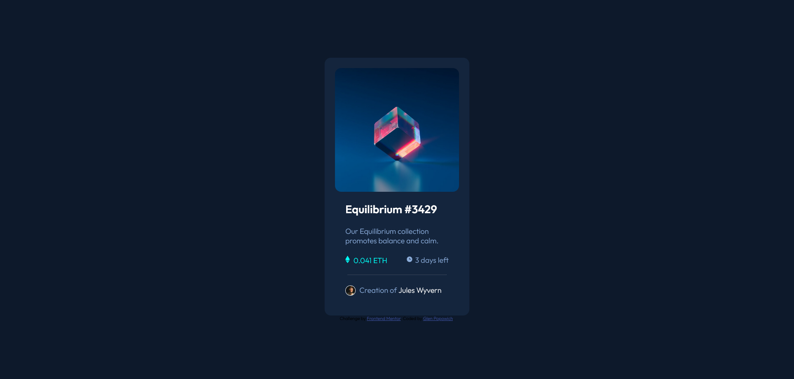

# Frontend Mentor - NFT preview card component solution

This is a solution to the [NFT preview card component challenge on Frontend Mentor](https://www.frontendmentor.io/challenges/nft-preview-card-component-SbdUL_w0U). Frontend Mentor challenges help you improve your coding skills by building realistic projects.

## Table of contents

- [Overview](#overview)
  - [The challenge](#the-challenge)
  - [Screenshot](#screenshot)
  - [Links](#links)
- [My process](#my-process)
  - [Built with](#built-with)
  - [What I learned](#what-i-learned)
  - [Useful resources](#useful-resources)
- [Author](#author)

## Overview

This is a project card with multiple live action points.

### The challenge

Users should be able to:

- View the optimal layout depending on their device's screen size
- See hover states for interactive elements

### Screenshot

### Links

- Solution URL: [Link to source code here](https://https://github.com/electricman07/nft-preview-card-component-main)
- Live Site URL: [link to live site here](https://nft-preview-card-component-wheat-tau.vercel.app/)

## My process

This was a more difficult project to complete. While the layout was rather easy to complete, making the image active and putting an overlay image and background color was more difficult and required looking on Slack for help. While I tried to use CSS to get the image overlay to work, it turned out I needed to use a link tag and create seperate divs for each image and then changing the opacity to toggle the background/foreground image and color.

### Built with

- Semantic HTML5 markup
- CSS custom properties
- Flexbox
-

### What I learned

I learned how to overlay an image with a background that had an opacity of .5 over an existing image.

``

### Author

- Website - [Glen Popowich](https://https://github.com/electricman07)
- Frontend Mentor - [@yelectricman07](https://www.frontendmentor.io/profile/electricman07)
- Twitter - [@glen_popowich](https://www.twitter.com/glen_popowich)
